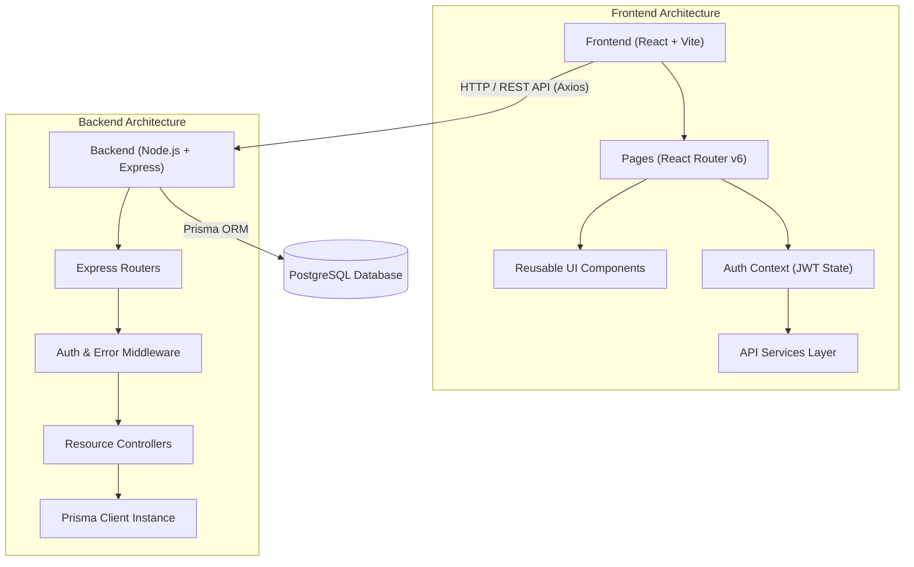

# BuildBoard Architecture Overview

This document describes the high-level architecture, directory layout, and data-flow of the BuildBoard open-source platform.

---

## High-Level Architecture

BuildBoard is designed as a classic decoupled full-stack application within a unified monorepo.

### Data Flow

1. **User Interaction**: The user interacts with the UI in the React client.
2. **HTTP Request**: An API service initiates an HTTP request via Axios, automatically attaching the JWT `Authorization: Bearer <token>` header if the user is authenticated.
3. **Route Handling**: The Express backend routes the request through `/api/...`.
4. **Middleware Validation**:
   - `requireAuth` validates the JWT token for protected routes (e.g., `POST /api/posts`, `PUT /api/posts/:id`, comments, likes).
   - Ownership checks ensure users can only modify their own resources.
   - Authoritative backend validators check fields, lengths, and enums.
5. **Database Interaction**: Controllers query PostgreSQL through Prisma ORM using typed query builders.
6. **Standardized Response**: The server sends a uniform JSON response format:
   - Success: `{ "success": true, "data": { ... } }`
   - Error: `{ "success": false, "message": "..." }`

---

## Directory Responsibilities

### `client/` (Frontend)
- `src/components/`: Reusable, accessible UI components (Button, Input, Textarea, Select, PostCard, Modal, EmptyState, etc.).
- `src/pages/`: Route-level pages (Home, ExplorePosts, PostDetail, CreatePost, EditPost, Profile, Login, Register, NotFound).
- `src/services/`: API communication abstraction using Axios.
- `src/context/`: React Context for managing global authentication state (`AuthContext.jsx`).
- `src/utils/`: Shared utilities (formatting dates, category constants).
- `src/index.css`: Pure Vanilla CSS design system with CSS custom properties and responsive breakpoints.

### `server/` (Backend)
- `src/controllers/`: Business logic and database operations for each domain.
- `src/routes/`: Route declarations and HTTP verb bindings.
- `src/middleware/`: Authentication checks, centralized error handling, and 404 handler.
- `src/services/`: Prisma client singleton.
- `src/utils/`: Input validation helpers and response formatters.
- `prisma/`: Prisma schema (`schema.prisma`) and development seed data script (`seed.js`).

---

## Security Model

1. **Password Hashing**: User passwords are never stored in plain text. They are salted and hashed with `bcryptjs` (cost factor 10).
2. **Zero Password Leakage**: Passwords are automatically stripped from all API outputs and excluded from user selection queries.
3. **JWT Authentication**: Authenticated routes require a signed JWT token with expiry.
4. **Authoritative Authorization**: Ownership of posts and comments is strictly enforced on the server. Unauthorized edits or deletions return `403 Forbidden`.
5. **Input Validation**: Length limits, email formatting, and whitelisted categories are enforced authoritatively on the server.
